# ZabbixWidgets

Independent Zabbix dashboard widgets built on Apache ECharts.

ZabbixWidgets adds one dashboard widget, **Extended Charts**, that offers 32 chart types drawn from your existing Zabbix items, several with more than one presentation. Pick a chart type in the widget's edit form and only the settings that chart uses are shown. Every chart has an explicit data contract: when the data does not fit, the widget says what is missing instead of drawing a misleading picture.

Tested against Zabbix 7.0, 7.2 and 7.4.

- [Gallery](#gallery)
- [Features](#features)
- [Installation](#installation)
- [Using the widget](#using-the-widget)
- [Documentation](#documentation)
- [Development](#development)

## Gallery

Each image is the module's own bundle drawing that chart's sample payload in Chromium (`npm run test:browser` with `SCREENSHOT_DIR` set), so the charts look as they do on a dashboard, without the surrounding Zabbix page. The sample hosts and values come from [`tests/fixtures/samples.js`](tests/fixtures/samples.js).

<table>
<tr>
<td align="center" width="33%">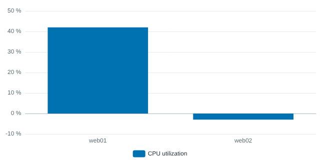<br><b>C01 Vertical Column</b><br><sub>Latest values side by side, grouped by host or item.</sub></td>
<td align="center" width="33%">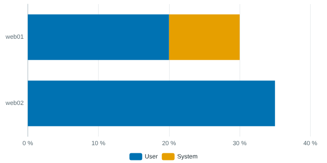<br><b>C02 Stacked Bar</b><br><sub>Parts of a whole per host, in one shared unit.</sub></td>
<td align="center" width="33%">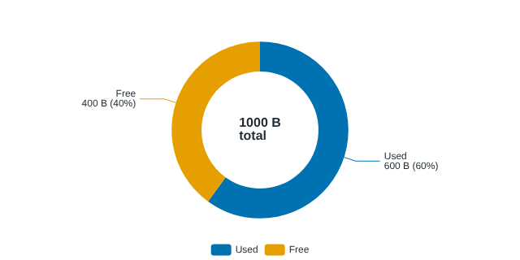<br><b>C03 Doughnut</b><br><sub>Shares of a total, with an optional centre sum or average.</sub></td>
</tr>
<tr>
<td align="center">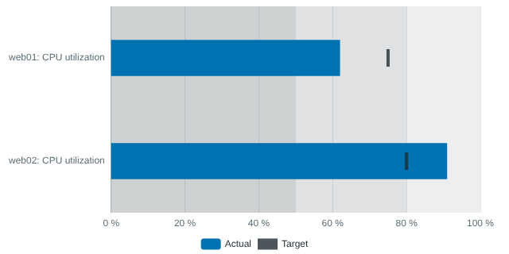<br><b>C04 Bullet Graph</b><br><sub>Actual against a target from an item, user macro or constant.</sub></td>
<td align="center">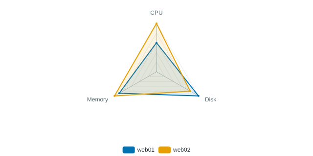<br><b>C05 Radar</b><br><sub>Several metrics per host on shared or per-axis scales.</sub></td>
<td align="center">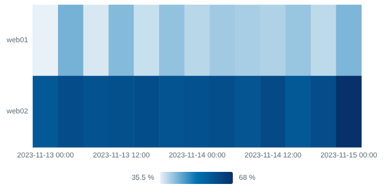<br><b>C06 Heat Map</b><br><sub>Hosts or items against time, coloured by value.</sub></td>
</tr>
<tr>
<td align="center">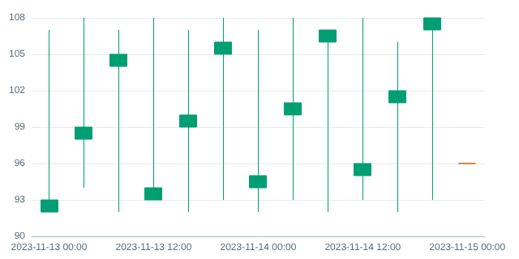<br><b>C07 Candlestick / OHLC</b><br><sub>Open, high, low and close from explicit items or derived from history.</sub></td>
<td align="center">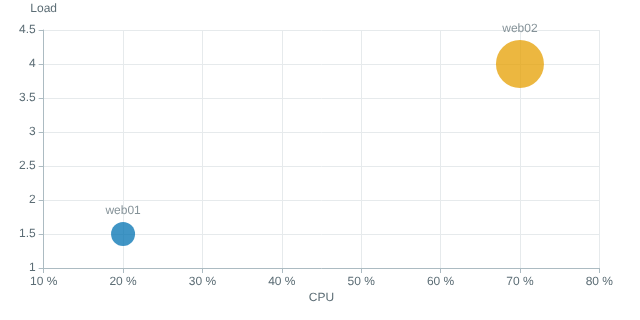<br><b>C08 Bubble</b><br><sub>Three metrics per host as position and size.</sub></td>
<td align="center">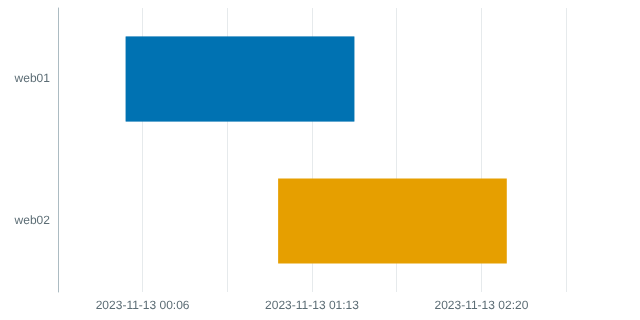<br><b>C09 Gantt</b><br><sub>Tasks from start and end, or start and duration, items.</sub></td>
</tr>
<tr>
<td align="center">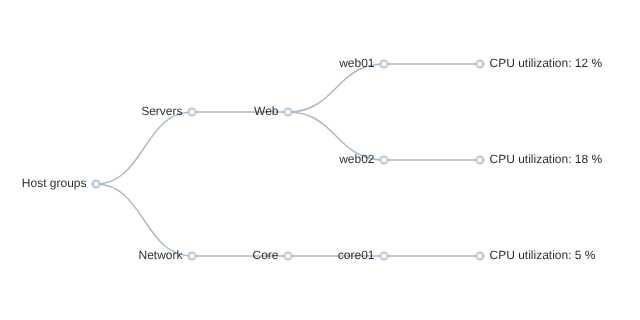<br><b>C10 Tree Diagram</b><br><sub>Host groups, hosts, tags and items as a hierarchy.</sub></td>
<td align="center">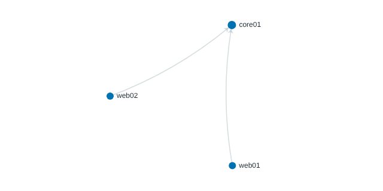<br><b>C11 Network / Graph Diagram</b><br><sub>Hosts linked by an edge list or by their tags.</sub></td>
<td align="center">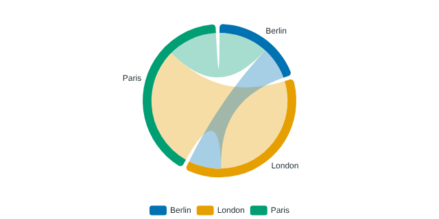<br><b>C12 Chord / Relationship</b><br><sub>Weighted flows between endpoints named by item tags.</sub></td>
</tr>
<tr>
<td align="center">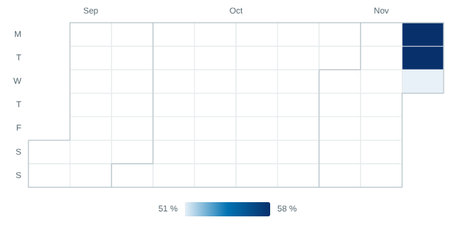<br><b>C13 Calendar Heat Map</b><br><sub>One cell per day, aggregated from history.</sub></td>
<td align="center">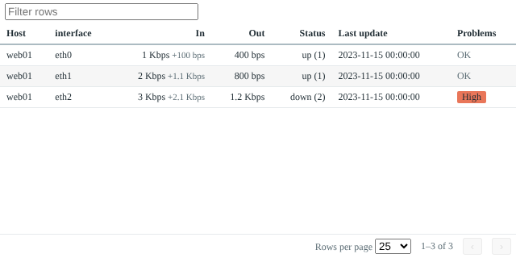<br><b>C14 LLD Data Table</b><br><sub>Discovered items as rows, with change, value maps and problems.</sub></td>
<td align="center">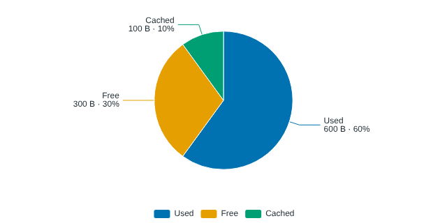<br><b>C15 Pie</b><br><sub>Shares of a total, sorted, with value and percentage labels.</sub></td>
</tr>
<tr>
<td align="center">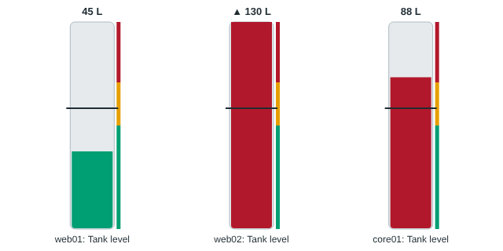<br><b>C16 Gauge</b><br><sub>Level tubes, dials, progress arcs or rings, with thresholds and a target.</sub></td>
<td align="center">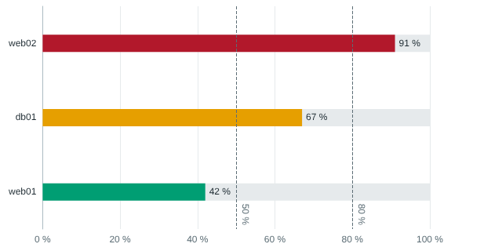<br><b>C17 Horizontal Ranking Bar</b><br><sub>Top or bottom N, coloured by threshold.</sub></td>
<td align="center">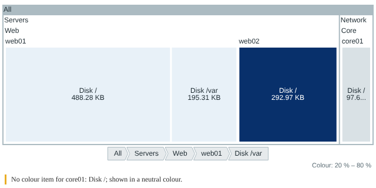<br><b>C18 Treemap</b><br><sub>Area by one item, colour by another, with drill-down.</sub></td>
</tr>
<tr>
<td align="center">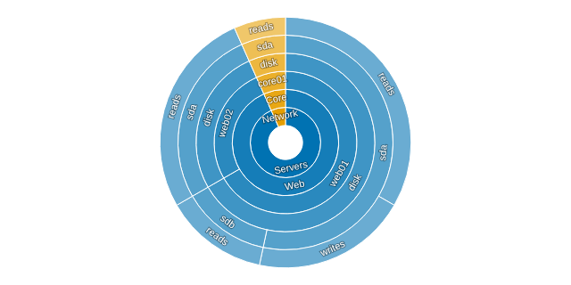<br><b>C19 Sunburst</b><br><sub>Groups, hosts and items as rings.</sub></td>
<td align="center">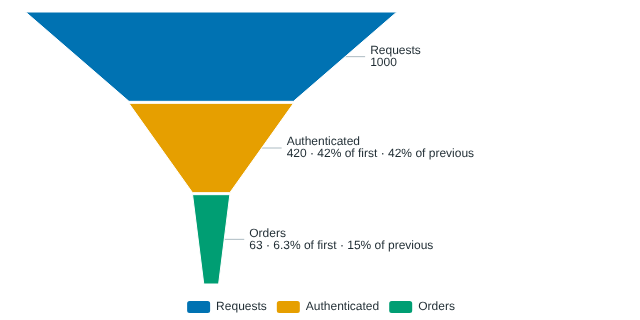<br><b>C20 Funnel</b><br><sub>Ordered stages with share of first and previous stage.</sub></td>
<td align="center">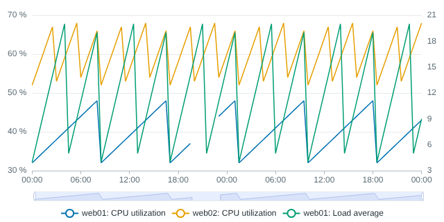<br><b>C21 Temporal Line</b><br><sub>History with gaps kept, one Y-axis per unit, zoom and pan.</sub></td>
</tr>
<tr>
<td align="center">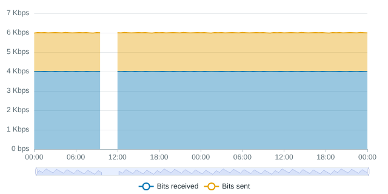<br><b>C22 Temporal Area</b><br><sub>Stacked or overlaid history areas.</sub></td>
<td align="center">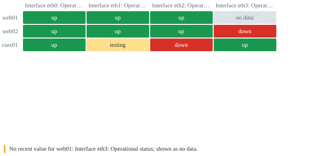<br><b>C23 Status Matrix</b><br><sub>Hosts against items, coloured by state or value map.</sub></td>
<td align="center">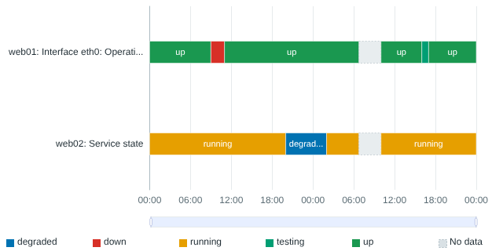<br><b>C24 State Timeline</b><br><sub>How long each item spent in each state.</sub></td>
</tr>
<tr>
<td align="center">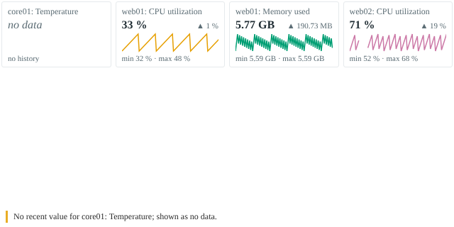<br><b>C25 Sparkline Grid</b><br><sub>A tile per item with its latest value, change and recent trend.</sub></td>
<td align="center">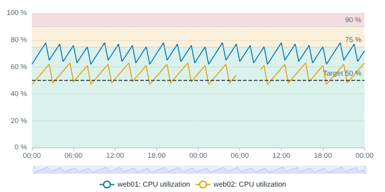<br><b>C26 Threshold Band</b><br><sub>History drawn over threshold bands, with an optional target line.</sub></td>
</tr>
<tr>
<td align="center">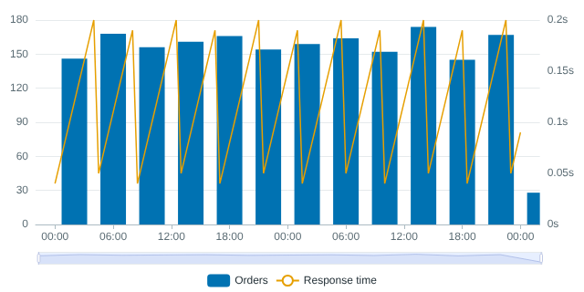<br><b>C28 Mixed Line and Bar</b><br><sub>Bars aggregated per period with lines over them, one axis per unit.</sub></td>
<td align="center">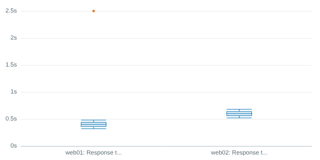<br><b>C29 Distribution</b><br><sub>Box plots or histograms of raw samples in the period.</sub></td>
<td align="center">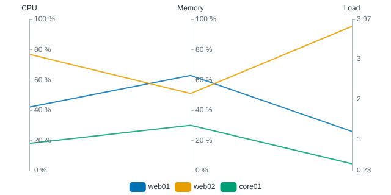<br><b>C30 Parallel Coordinates</b><br><sub>Several metrics per host side by side, one axis each.</sub></td>
</tr>
<tr>
<td align="center">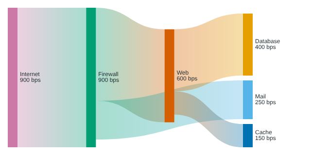<br><b>C31 Sankey</b><br><sub>Directed flows between endpoints named by item tags.</sub></td>
<td align="center">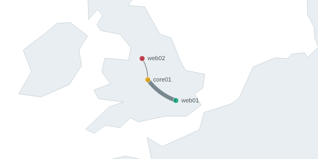<br><b>C32 Geographic Site Map</b><br><sub>Hosts at their inventory coordinates over a bundled map.</sub></td>
<td align="center">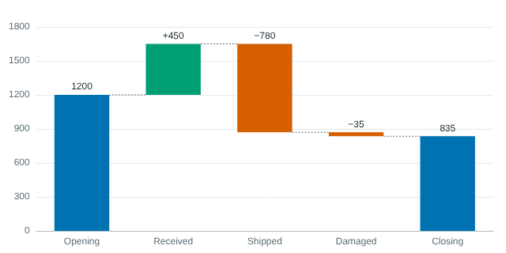<br><b>C33 Waterfall</b><br><sub>Contributions from one level to the next, with totals.</sub></td>
</tr>
<tr>
<td align="center">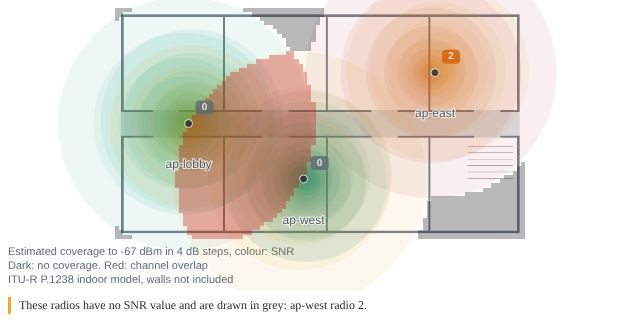<br><b>C34 Wireless Floor Map</b><br><sub>Access points on a floor plan, with estimated coverage per radio coloured by SNR.</sub></td>
</tr>
</table>

### Presentation options

Charts that share a data contract offer several presentations, chosen in the edit form. Saved widgets keep their original presentation.

<table>
<tr>
<td align="center" width="33%">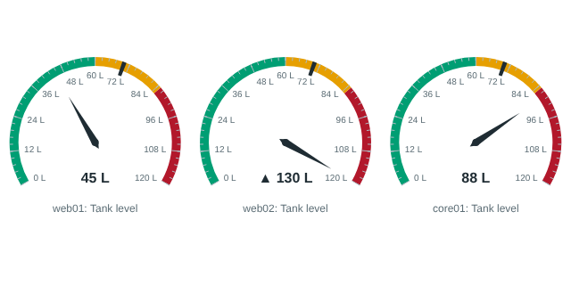<br><b>C16 Gauge: dial</b></td>
<td align="center" width="33%">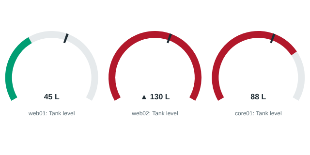<br><b>C16 Gauge: progress arc</b></td>
<td align="center" width="33%">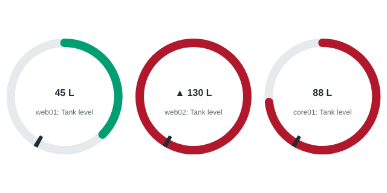<br><b>C16 Gauge: ring</b></td>
</tr>
<tr>
<td align="center">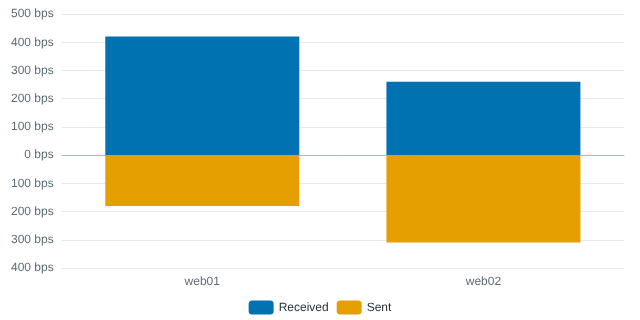<br><b>C02 Stacked Bar: diverging</b></td>
<td align="center">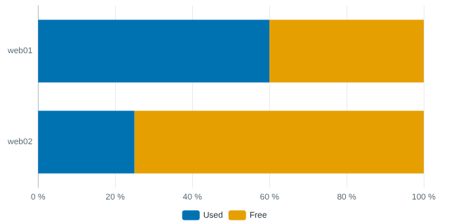<br><b>C02 Stacked Bar: percentage</b></td>
<td align="center">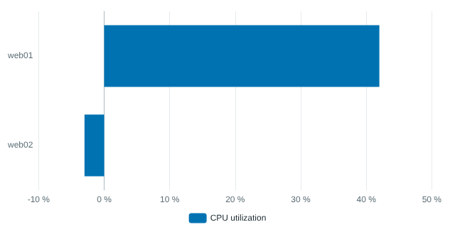<br><b>C01 Column: horizontal</b></td>
</tr>
<tr>
<td align="center">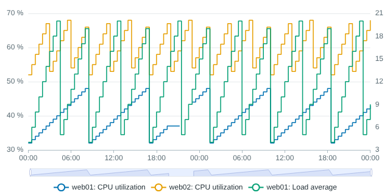<br><b>C21 Line: stepped</b></td>
<td align="center">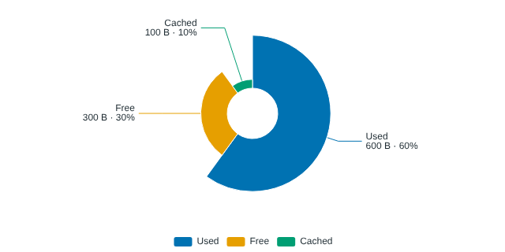<br><b>C15 Pie: rose</b></td>
<td align="center">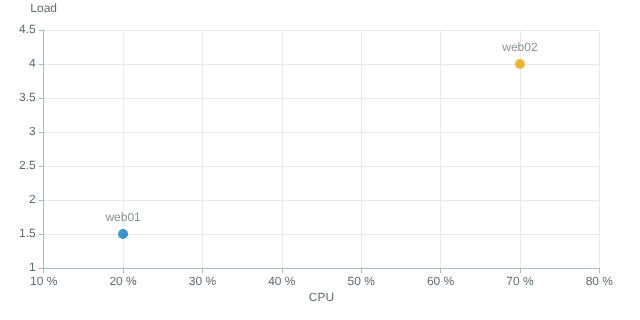<br><b>C08 Bubble: XY scatter</b></td>
</tr>
<tr>
<td align="center">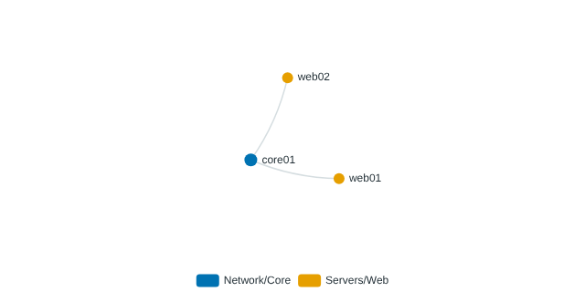<br><b>C11 Network: force layout, host group colours</b></td>
<td align="center">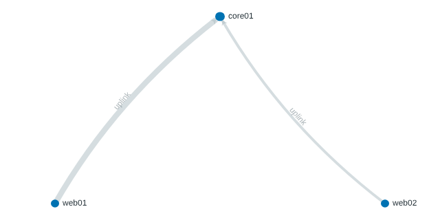<br><b>C11 Network: fixed positions, weighted links</b></td>
<td align="center">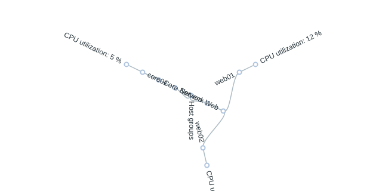<br><b>C10 Tree: radial</b></td>
</tr>
<tr>
<td align="center">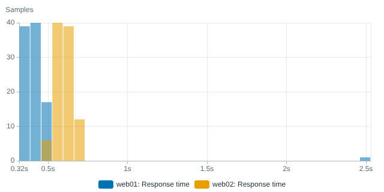<br><b>C29 Distribution: histogram</b></td>
<td align="center">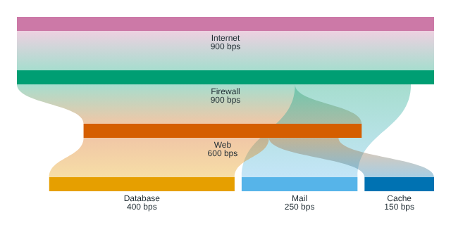<br><b>C31 Sankey: vertical</b></td>
<td align="center">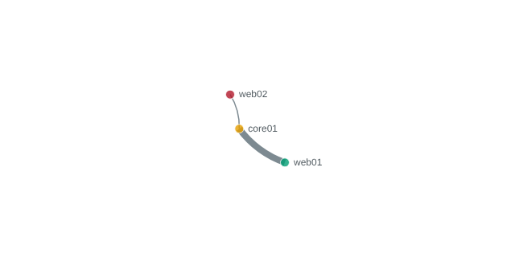<br><b>C32 Site Map: no base map</b></td>
</tr>
</table>

Screenshots of the edit form and of each chart on a live Zabbix dashboard are taken by the `Zabbix integration` workflow on every run and attached to the run as artifacts (under `showcase/`).

## Features

### Charts

| Code | Chart | Data it reads |
|---|---|---|
| C01 | Vertical Column | Latest values |
| C02 | Stacked Bar | Latest values |
| C03 | Doughnut | Latest values |
| C04 | Bullet Graph | Latest values, target item, user macro or constant |
| C05 | Radar | Latest values |
| C06 | Heat Map | Latest values and history |
| C07 | Candlestick / OHLC | History (explicit OHLC items, or derived from one item) |
| C08 | Bubble | Latest values for X, Y and size |
| C09 | Gantt | Latest values for start, end or duration, and progress |
| C10 | Tree Diagram | Latest values, hosts, host groups and tags |
| C11 | Network / Graph Diagram | Latest values, hosts, tags or an edge list |
| C12 | Chord / Relationship Diagram | Latest values and tags |
| C13 | Calendar Heat Map | History |
| C14 | LLD Data Table | Latest and previous values, value maps and problems |
| C15 | Pie | Latest values |
| C16 | Gauge (level, dial, progress, ring) | Latest values and user macros |
| C17 | Horizontal Ranking Bar | Latest values and user macros |
| C18 | Treemap | Latest values, hosts, host groups and tags |
| C19 | Sunburst | Latest values, hosts, host groups and tags |
| C20 | Funnel | Latest values |
| C21 | Temporal Line | History and user macros |
| C22 | Temporal Area | History and user macros |
| C23 | Status Matrix | Latest values, value maps, problems and user macros |
| C24 | State Timeline | History and value maps |
| C25 | Sparkline Grid | Latest values and history |
| C26 | Threshold Band | History and user macros |
| C28 | Mixed Line and Bar | History (trends for long periods) and user macros |
| C29 | Distribution (Boxplot / Histogram) | Raw history only |
| C30 | Parallel Coordinates | Latest values and tags |
| C31 | Sankey | Latest values and tags |
| C32 | Geographic Site Map | Latest values, host inventory location, user macros and an optional map file |
| C33 | Waterfall | Latest values |
| C34 | Wireless Floor Map | Latest values, value maps, a Zabbix background image, host macros and host tags |

[Chart contracts](docs/CHART-CONTRACTS.md) lists every role, setting and rule per chart. [Apache ECharts example coverage](docs/ECHARTS-COVERAGE.md) compares each example in the official ECharts gallery with what the module draws, and says why the rest are not offered.

Presentation options within existing charts:

- **C01 Column**: vertical or horizontal.
- **C02 Stacked Bar**: values, percentage of each category, or diverging (opposing items extend the other way from zero); horizontal or vertical.
- **C03 Doughnut and C15 Pie**: rose layout by radius or area, inner and outer radius, label position.
- **C08 Bubble**: bubble size from an item, or a plain XY scatter without one.
- **C10 Tree**: left to right, right to left, top down, bottom up or radial.
- **C11 Network**: circular, force or fixed layout; directed or undirected; node colours by host group or host tag; host and link labels; link widths from a number or an item.
- **C16 Gauge**: level tube, dial, progress arc or ring.
- **C21 Temporal Line and C28**: straight, smoothed or stepped lines (hold until the next sample, back to the previous one, or change halfway).

### Trustworthy data

- Each chart has a data contract. When it is not met, the widget lists the reasons (missing items, non-numeric values, mixed units, negative shares) instead of drawing.
- Nothing is invented: no chart makes up targets, OHLC values, timestamps, durations, topology, hierarchy or flow weights.
- Items with no recent value are shown as "no data", never as zero.
- Time series use real samples only. Lines break at gaps (2.5 update intervals by default, or a maximum you set) instead of joining across them.
- Long periods are read from hourly trends, short ones from history.
- Ambiguous mappings, such as two items for one table cell, are reported, never guessed.
- Distributions are computed from raw history only; hourly trends cannot give quartiles, outliers or bins, so a period that would need them is refused.
- Percentage stacks, Sankey flows and waterfall steps are only drawn for values that add up, and a category with a missing member is left empty rather than shared out.
- Sites are placed only at the latitude and longitude in host inventory, and nothing is fetched from map services.
- Network and map links say that two hosts are connected; a link shows a measured value only when its weight names an item. Relationships such as LLDP neighbours or LAG membership are never shown as traffic.
- Samples with the same second are kept in Zabbix's nanosecond order, and calendar-day buckets follow the dashboard time zone across daylight-saving changes.

### Zabbix integration

- One widget, **Extended Charts**, with a **Chart type** selector. The edit form shows only the settings the selected chart uses, and hides shared settings (such as the legend) where a chart has no use for them.
- Host group, host and item selection, the dashboard's time period (or a period of the widget's own), and template dashboards.
- Light and dark Zabbix themes.
- Thresholds, targets and scale limits accept numbers or user macros, resolved per host through nested templates in Zabbix's order.
- Value mappings, previous values, and triggers in the problem state with Zabbix's severity names and colours, where a chart uses them.
- Data is read as the signed-in user, so users see only hosts they may read, within fixed limits on hosts, items and history values.

### Interaction

- Crosshair tooltip on time series, with each series' nearest sample.
- Zoom and pan on time series, drill-down on the treemap, sorting and filtering in the LLD table.
- Legend selection, zoom, table sorting, dragged network nodes and the map view survive refreshes.

### Runs beside other modules

- ECharts 6.1.0 is bundled privately, so the module never touches `window.echarts` and can run next to modules that load their own copy.
- Its own module id, PHP namespace, JavaScript class and CSS scope.

### Release quality

- Lint (JavaScript and PHP), unit, contract, renderer, UI, security, performance and browser tests on every change, plus an end-to-end test against Zabbix 7.0, 7.2 and 7.4 in Docker. See [Testing](docs/TESTING.md).
- Reproducible release packages: the same commit builds the same bytes, published with a SHA-256 checksum.

## Installation

### Requirements

- Zabbix frontend 7.0, 7.2 or 7.4.
- Access to the frontend's `modules` directory on the web server.
- A Zabbix Super admin account to enable the module.
- For the Geographic Site Map: host inventory enabled on the hosts it shows, with **Location latitude** and **Location longitude** filled in. Optional custom maps are GeoJSON files placed in the module's `assets/geo` folder (see [its README](modules/extended-charts/assets/geo/README.md)).
- For the Wireless Floor Map: the floor plan uploaded in **Administration > General > Images** with the type **Background** (PNG, JPEG or GIF), and each access point's position set in its own host macros (see [Wireless Floor Map](#wireless-floor-map)) or in the widget's positions list.

### 1. Download

Download `zabbixwidgets-charts-<version>.zip` and its `.sha256` file from the [Releases](https://github.com/sjackson0109/ZabbixWidgets/releases) page, then check it:

```sh
sha256sum -c zabbixwidgets-charts-1.0.0.zip.sha256
```

### 2. Copy into the modules directory

The archive holds one folder, `zabbixwidgets_charts`. Unzip it into the frontend's `modules` directory:

| Install | Modules directory |
|---|---|
| Zabbix 7.0 packages | `/usr/share/zabbix/modules` |
| Zabbix 7.2 and 7.4 packages | `/usr/share/zabbix/ui/modules` |
| Source install | `<frontend root>/modules` |

```sh
cd /usr/share/zabbix/modules            # or /usr/share/zabbix/ui/modules
sudo unzip /path/to/zabbixwidgets-charts-1.0.0.zip
sudo chmod -R a+rX zabbixwidgets_charts
```

The web server user must be able to read the files. Nothing needs to be restarted.

For the official Docker images, copy the folder into the web container's modules directory (or mount it there):

```sh
docker cp zabbixwidgets_charts <web-container>:/usr/share/zabbix/modules/   # ui/modules on 7.2 and 7.4
```

### 3. Enable the module

1. In Zabbix, go to **Administration > General > Modules**.
2. Click **Scan directory**.
3. Find **ZabbixWidgets Extended Charts** and click **Disabled** to enable it.

### Upgrading

Replace the `zabbixwidgets_charts` folder with the one from the new release and reload the dashboard. Saved widgets keep their settings: stored chart types and option values never change between releases.

### Removing

Remove its widgets from dashboards, disable the module under **Administration > General > Modules**, then delete the `zabbixwidgets_charts` folder. Widgets left on a dashboard show as inaccessible once the module is disabled.

### Installing from source

```sh
git clone https://github.com/sjackson0109/ZabbixWidgets.git
cd ZabbixWidgets
npm ci
npm run build    # builds the JavaScript bundle into the module
npm run package  # optional: dist/zabbixwidgets-charts-<version>.zip
```

Then copy `modules/extended-charts` into the modules directory as `zabbixwidgets_charts`, or use the zip from `dist/` as above. The bundle is not committed, so the build step is required.

## Using the widget

1. Open a dashboard (or a template dashboard) and click **Edit dashboard**, then **Add widget**.
2. Set **Type** to **Extended Charts**.
3. Choose a **Chart type**. The form now shows only that chart's settings.
4. Select host groups or hosts, and the items for each role the chart asks for.
5. Save the widget and the dashboard.

If the widget shows a message instead of a chart, it names what is missing or incompatible, for example an item that is not numeric, mixed units or a required role with no item.

### Wireless Floor Map

The Wireless Floor Map draws access points that are Zabbix hosts on a floor plan, with one ring per radio. It shows what Zabbix already has: it does not survey, interpolate or estimate coverage.

1. Upload the floor plan in **Administration > General > Images** as a **Background** image, and enter its name in **Floor plan image**.
2. Give each access point a position in percent of the image: 0 to 100 across from the left, and 0 to 100 down from the top. Set `{$WIFI.MAP.X}` and `{$WIFI.MAP.Y}` (or the macros you name in the form) on the host itself; a value inherited from a template or set globally is ignored, because it would put every access point on the same spot. Alternatively choose **Positions list** and write one `host name = across, down` per line.
3. Narrow the hosts with host groups, hosts and **Host tags** (for example `floor=2`, or `floor=2, building=HQ`; different tags must all match).
4. Map the band, channel, channel width, SNR, transmit power and rogue AP items. Item patterns match anywhere in the item name, so make each one distinct (for example `Radio * band` and `Radio * channel width` rather than `Radio * channel`, which would also match the width items).
5. Choose how items are grouped into radios: by the first key parameter (for example `wlan.radio.snr[{#RADIO}]`), by an item tag, or by a regular expression on the item name with a capture group.

**Estimated coverage** (the default ring style) draws nine translucent discs per radio, one for each signal level in 4 dB steps down to the coverage edge (−67 dBm by default). They stack up towards the access point, so the fade follows the signal. Each disc's radius comes from the ITU-R P.1238 indoor path loss model, `L = 20·log10(f MHz) + N·log10(d m) − 28`, using the radio's transmit power item (dBm EIRP) or a power you enter, its channel's centre frequency, and a distance loss coefficient N per band (28, 31 and 31 for 2.4, 5 and 6 GHz by default, the model's office values). Enter the floor plan's real width in metres so metres can be drawn to scale. This is an estimate: walls, floors and furniture are not included, so real coverage is usually smaller, and the chart's key says so. Each band's discs are offset a few pixels (2.4 GHz left, 5 GHz up and right, 6 GHz down and right) so that their centres stay apart. Choose **Band only** for small rings that show the band and nothing else.

From the same model the map can shade **coverage gaps** (dark: no radio reaches the coverage edge) and **channel overlap** (red: two access points on overlapping spectrum both reach it there). Overlap is worked out from each radio's band, channel and channel width: on 5 and 6 GHz a wide channel is its fixed block of 20 MHz channels (80 MHz on channel 44 is 36 to 48), and on 2.4 GHz a 40 MHz channel counts both sides of its primary channel because the item does not say which side is used. So 2.4 GHz channels 1 and 3 overlap at 20 MHz, while 1 and 6 do not. Both layers are estimates on a grid of 96 cells across the plan; switch either off in the widget.

The scale comes from the plan, not the widget: metres are converted with the floor plan width you enter, and the whole plan, with the rings on it, is fitted into the widget at its own aspect ratio. Resizing the widget, or zooming and panning inside it, scales everything together.

The band must come from the band item: a value in GHz or MHz, or a value mapping whose text names the band (for example `5 GHz`). It is never worked out from the channel number. Rogue APs are counted from one item's value, or as the number of matching items when each rogue is its own discovered item; they are shown on the access point that reports them and are never placed on the plan.

## Documentation

- [Chart contracts](docs/CHART-CONTRACTS.md)
- [Apache ECharts example coverage](docs/ECHARTS-COVERAGE.md)
- [Architecture](docs/ARCHITECTURE.md)
- [Testing](docs/TESTING.md)
- [Releasing](docs/RELEASING.md)
- [Changelog](CHANGELOG.md)
- [Third-party notices](THIRD_PARTY_NOTICES.md)

## Development

```sh
npm ci
npm run check   # lint (JS and PHP), tests, build, browser test, docs, licences
npm run package # release zip in dist/
```

To refresh the gallery images:

```sh
npm run build
SCREENSHOT_DIR=docs/screenshots npm run test:browser
```

## Licence

Released under the MIT licence, see [LICENSE](LICENSE). Apache ECharts and its dependencies are under their own licences, see [Third-party notices](THIRD_PARTY_NOTICES.md).
